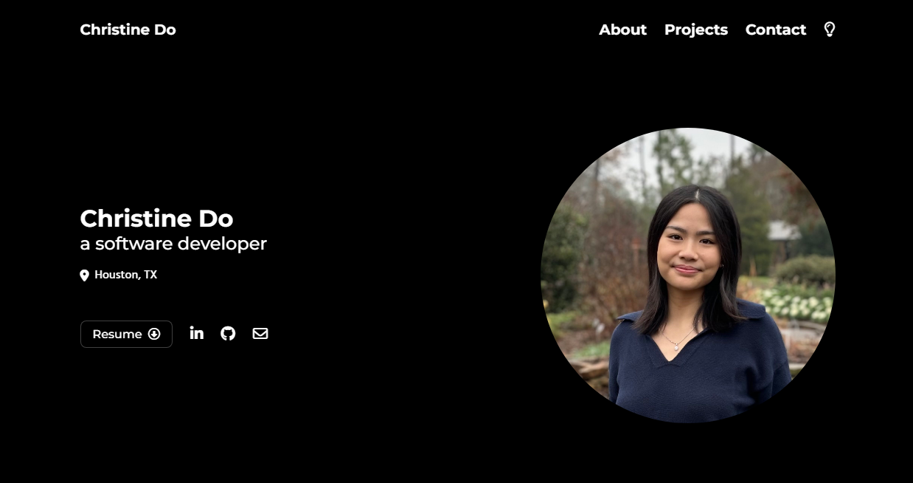

<h1 align="center">Portfolio 👩🏻‍💻</h1>

    

<h2 align="left">About 💡</h2>

Welcome to my portfolio—an evolving showcase of my creations, projects, and passions brought to life. This space reflects my coding endeavors, capturing the ideas I've crafted and the stories I've told through my work. 

<h2 align="left">Technologies Used ⚙️</h2>

  
  
  
  
  

